

  

<h1 align="center">
   
   
  𝐈'𝐦 𝐁𝐚𝐛𝐢𝐧 𝐁𝐢𝐝
</h1>

  <strong>Building intelligent software at the intersection of AI, engineering & innovation.</strong>

  

  
  
  
  

---

<h2 align="center">&nbsp; 𝐀𝐛𝐨𝐮𝐭 𝐌𝐞 &nbsp;</h2>

### `> whoami`

<table align="center">
<tr>
<td width="50%" valign="top">

### &nbsp; 𝐖𝐡𝐨 𝐈 𝐀𝐦 &nbsp;

I'm a **Computer Science & Engineering student** who enjoys turning ideas into real-world software.

My interests sit at the intersection of:

* Artificial Intelligence
* Full Stack Engineering
* Cloud & DevOps
* Data & Machine Learning
* Open Source

</td>

<td width="50%" valign="top">

### &nbsp; 𝐖𝐡𝐚𝐭 𝐈 𝐃𝐨 &nbsp;

I like building systems that combine **good engineering with useful ideas**.

Currently focused on:

* AI-powered applications
* Full-stack platforms
* Machine learning experiments
* Cloud-native systems
* Open-source projects

</td>
</tr>
</table>

 

<h3 align="center">&nbsp; 𝐌𝐲 𝐃𝐞𝐯𝐞𝐥𝐨𝐩𝐞𝐫 𝐉𝐨𝐮𝐫𝐧𝐞𝐲 &nbsp;</h3>

`Think` → `Learn` → `Build` → `Break` → `Debug` → `Improve` → `Repeat`

 

<h3 align="center">&nbsp; 𝐌𝐲 𝐌𝐢𝐬𝐬𝐢𝐨𝐧 &nbsp;</h3>

**Build. Innovate. Contribute. Impact.**

Creating meaningful software, contributing to open source,
 
and continuously exploring what technology can make possible.

---

<h2 align="center">&nbsp; 𝐖𝐡𝐚𝐭 𝐈 𝐁𝐮𝐢𝐥𝐝 &nbsp;</h2>

### `> ./what_i_build.sh`

<table align="center">
<tr>

<td align="center" width="25%">

  

**AI & ML**

Intelligent applications, machine learning systems and data-driven solutions.

</td>

<td align="center" width="25%">

  

**Full Stack**

Modern web platforms, APIs, dashboards and real-time applications.

</td>

<td align="center" width="25%">

  

**Cloud**

Deployment, infrastructure, containers and modern development workflows.

</td>

<td align="center" width="25%">

  

**Open Source**

Contributing, experimenting, collaborating and building for the community.

</td>

</tr>
</table>

---

<h2 align="center">&nbsp; 𝐅𝐚𝐯𝐨𝐫𝐢𝐭𝐞 𝐖𝐨𝐫𝐤𝐬 𝐨𝐟 𝐀𝐥𝐥 𝐓𝐢𝐦𝐞 &nbsp;</h2>

### `> ls -la ~/favorite-works/`

<em>Handcrafted tools, intelligent platforms & full-stack systems</em>

<table align="center" width="100%">
<tr>

<td width="50%" valign="top">

### &nbsp; [**AI Data Analysis**](https://github.com/Babin123456/Ai-Data-Analysis)
**Full-Stack GenAI Data Analysis & Business Intelligence Platform**

Automated data analytics workspace running natural-language text-to-SQL querying via Groq LLaMA, in-memory DuckDB computations and dynamic Plotly charts.

* **Highlights:** Natural-language SQL generator, in-memory data processing, instant CSV analysis.
* **Tech Stack:**  
  
  
  
  
  

</td>

<td width="50%" valign="top">

### &nbsp; [**Babin.Portfolio**](https://github.com/Babin123456/Babin.Portfolio)
**Interactive Personal Developer Portfolio**

Cutting-edge developer portfolio showcasing academic research, project demos, interactive hacker terminal emulator, 430+ verified certificates and dual-accent dark/light themes.

* **Highlights:** Three.js 3D canvas, interactive terminal emulator, responsive glassmorphism.
* **Tech Stack:**  
  
  
  
  
  
  

</td>

</tr>
<tr>

<td width="50%" valign="top">

### &nbsp; [**CargoConnect**](https://github.com/Babin123456/CargoConnect)
**India's Premier Logistics & Cargo Transfer Booking Platform**

Full-stack transport booking platform featuring instant vehicle estimates, fare calculations, automated PDF invoices and serverless notifications.

* **Highlights:** Dynamic distance fare estimation, jsPDF invoice generation, serverless email alerts.
* **Tech Stack:**  
  
  
  
  
  

</td>

<td width="50%" valign="top">

### &nbsp; [**CivicSignal AI**](https://github.com/Babin123456/CivicSignal)
**Autonomous Multi-Modal AI & Geospatial Civic Triage Engine**

Autonomous civic issue reporting engine with computer vision hazard detection (YOLO), zero-shot NLP triage and 2dsphere spatial mapping.

* **Highlights:** YOLOv8 vision pipeline, automated severity scoring, geospatial proximity clustering.
* **Tech Stack:**  
  
  
  
  
  

</td>

</tr>
<tr>

<td width="50%" valign="top">

### &nbsp; [**EduPilot AI**](https://github.com/Babin123456/EduPilot-AI)
**Intelligent Academic Operational Layer for Higher Education**

Academic intelligence platform tailored for universities featuring multi-key dual Groq + Gemini Vision routers, RAG search and student dashboards.

* **Highlights:** High-throughput multi-key LLM failover, multimodal paper parsing, syllabus RAG search.
* **Tech Stack:**  
  
  
  
  
  

</td>

<td width="50%" valign="top">

### &nbsp; [**KrishiBhoomi AI**](https://github.com/Babin123456/KrishiBhoomi-AI)
**Production-Quality AI Agricultural Intelligence Platform**

Comprehensive agricultural platform integrating XGBoost crop recommendations, CNN leaf disease detection, FAISS scheme RAG and voice advisory in 11 languages.

* **Highlights:** Multi-model ensemble diagnosis, multilingual voice agent, vector search over government schemes.
* **Tech Stack:**  
  
  
  
  
  

</td>

</tr>
<tr>

<td width="50%" valign="top">

### &nbsp; [**ML-Based Price Prediction**](https://github.com/Babin123456/ML-Based-Price-Prediction)
**For Agri-Horticultural Commodities (Springer Nature)**

Empirical agricultural economics research modeling multi-seasonal commodity prices via Random Forest and SVR ensembles across harvest seasons.

* **Highlights:** Multi-season price forecasting, regression ensembles, published under Springer Nature.
* **Tech Stack:**  
  
  
  
  

</td>

<td width="50%" valign="top">
</td>

</tr>
</table>

---

<h2 align="center">&nbsp; 𝐎𝐩𝐞𝐧 𝐒𝐨𝐮𝐫𝐜𝐞 & 𝐀𝐜𝐡𝐢𝐞𝐯𝐞𝐦𝐞𝐧𝐭𝐬 &nbsp;</h2>

### `> cat achievements.log`

<em>Building in Public • Learning in Public • Contributing in Public</em>

 

<!-- ===================== GITHUB ACHIEVEMENTS ===================== -->
<h3>&nbsp; 𝐎𝐟𝐟𝐢𝐜𝐢𝐚𝐥 𝐆𝐢𝐭𝐇𝐮𝐛 𝐀𝐜𝐡𝐢𝐞𝐯𝐞𝐦𝐞𝐧𝐭𝐬 &nbsp;</h3>

  <a href="https://github.com/Babin123456?tab=achievements" title="Pull Shark (x4) - Merged multiple PRs">
    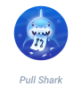
  </a>&nbsp;&nbsp;
  &nbsp;&nbsp;
  &nbsp;&nbsp;
  

 
<em>Click badges to view verified achievements on GitHub</em>

  

<!-- ===================== SUMMER OF CODE & OPEN SOURCE BADGES ===================== -->
<h3>&nbsp; 𝐎𝐩𝐞𝐧 𝐒𝐨𝐮𝐫𝐜𝐞 𝐏𝐫𝐨𝐠𝐫𝐚𝐦 𝐁𝐚𝐝𝐠𝐞𝐬 &nbsp;</h3>

<em>Honors, tiers, and milestones earned across open-source programs and initiatives</em>

 

<!-- ===================== GSSoC 2026 ===================== -->
<h4>&nbsp; 𝐆𝐢𝐫𝐥𝐒𝐜𝐫𝐢𝐩𝐭 𝐒𝐮𝐦𝐦𝐞𝐫 𝐨𝐟 𝐂𝐨𝐝𝐞 𝟐𝟎𝟐𝟔 (𝐆𝐒𝐒𝐨𝐂 '𝟐𝟔) &nbsp;</h4>

  

<strong>&nbsp; 𝐇𝐚𝐥𝐥 𝐨𝐟 𝐅𝐚𝐦𝐞 & 𝐓𝐨𝐩 𝐑𝐚𝐧𝐤𝐬 &nbsp;</strong>

  &nbsp;&nbsp;
  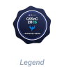&nbsp;&nbsp;
  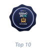&nbsp;&nbsp;
  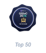&nbsp;&nbsp;
  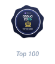&nbsp;&nbsp;
  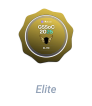&nbsp;&nbsp;
  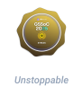

 

<strong>&nbsp; 𝐒𝐭𝐫𝐞𝐚𝐤𝐬 & 𝐂𝐨𝐧𝐬𝐢𝐬𝐭𝐞𝐧𝐜𝐲 &nbsp;</strong>

  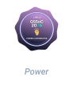&nbsp;&nbsp;
  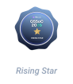&nbsp;&nbsp;
  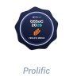&nbsp;&nbsp;
  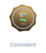&nbsp;&nbsp;
  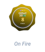&nbsp;&nbsp;
  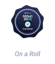&nbsp;&nbsp;
  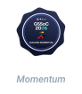&nbsp;&nbsp;
  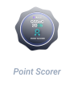

 

<strong>&nbsp; 𝐒𝐩𝐞𝐜𝐢𝐚𝐥𝐢𝐳𝐞𝐝 𝐓𝐫𝐚𝐜𝐤𝐬 & 𝐁𝐨𝐮𝐧𝐭𝐢𝐞𝐬 &nbsp;</strong>

  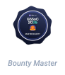&nbsp;&nbsp;
  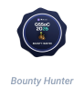&nbsp;&nbsp;
  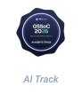&nbsp;&nbsp;
  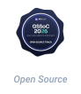

 

<strong>&nbsp; 𝐌𝐢𝐥𝐞𝐬𝐭𝐨𝐧𝐞𝐬 & 𝐎𝐧𝐛𝐨𝐚𝐫𝐝𝐢𝐧𝐠 &nbsp;</strong>

  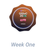&nbsp;&nbsp;
  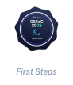&nbsp;&nbsp;
  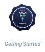&nbsp;&nbsp;
  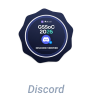&nbsp;&nbsp;
  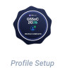&nbsp;&nbsp;
  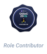&nbsp;&nbsp;
  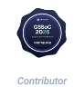

 
<em><a href="https://gssoc.girlscript.org/profile/77dcd93c-f754-4bb4-9516-16a2cf29988c" style="text-decoration: none;">View verified profile on GSSoC</a></em>

  

<!-- ===================== ELUSoC 2026 ===================== -->
<h4>&nbsp; 𝐄𝐋𝐔 𝐒𝐮𝐦𝐦𝐞𝐫 𝐨𝐟 𝐂𝐨𝐝𝐞 𝟐𝟎𝟐𝟔 (𝐄𝐋𝐔𝐒oC '𝟐𝟔) &nbsp;</h4>

  

<em>Tier Progression: From Spawnling to Repo Legend</em>

  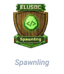&nbsp;&nbsp;
  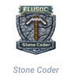&nbsp;&nbsp;
  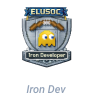&nbsp;&nbsp;
  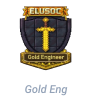&nbsp;&nbsp;
  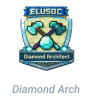&nbsp;&nbsp;
  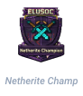&nbsp;&nbsp;
  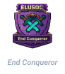&nbsp;&nbsp;
  

 
<em><a href="https://www.edulinkup.dev/u/babin123?tab=elusoc" style="text-decoration: none;">View verified profile on ELUSoC</a></em>

  

<!-- ===================== ECSoC 2026 ===================== -->
<h4>&nbsp; 𝐄𝐂 𝐒𝐮𝐦𝐦𝐞𝐫 𝐨𝐟 𝐂𝐨𝐝𝐞 𝟐𝟎𝟐𝟔 (𝐄𝐂𝐒𝐨𝐂 '𝟐𝟔) &nbsp;</h4>

  

<em>Mastery Tiers: From Beginner to Master</em>

  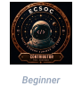&nbsp;&nbsp;
  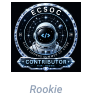&nbsp;&nbsp;
  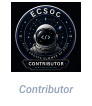&nbsp;&nbsp;
  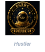&nbsp;&nbsp;
  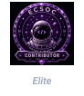&nbsp;&nbsp;
  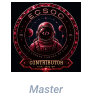

 
<em><a href="https://www.summerofcode.xyz/profile/contributor/Babin123456" style="text-decoration: none;">View verified profile on ECSoC</a></em>

  

<!-- ===================== NSoC 2026 ===================== -->
<h4>&nbsp; 𝐍𝐞𝐱𝐮𝐬 𝐒𝐮𝐦𝐦𝐞𝐫 𝐨𝐟 𝐂𝐨𝐝𝐞 𝟐𝟎𝟐𝟔 (𝐍𝐒𝐨𝐂 '𝟐𝟔) &nbsp;</h4>

  

<em>Contributor Milestones</em>

  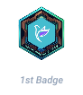&nbsp;&nbsp;
  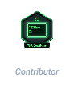

 
<em><a href="https://lnkd.in/p/dSN98zxP" style="text-decoration: none;">View official announcement & verification on LinkedIn</a></em>

---

<h2 align="center">&nbsp; 𝐓𝐞𝐜𝐡 𝐒𝐭𝐚𝐜𝐤 &nbsp;</h2>

### `> neofetch --skills`

*Technologies I use to turn ideas into working systems.*

<table align="center">
<tr>
<td align="center" width="240"><strong>Category</strong></td>
<td align="center"><strong>Technologies</strong></td>
</tr>

<tr>
<td align="center">
  &nbsp; <strong>Languages</strong>
</td>
<td align="center">

</td>
</tr>

<tr>
<td align="center">
  &nbsp; <strong>Frontend</strong>
</td>
<td align="center">

</td>
</tr>

<tr>
<td align="center">
  &nbsp; <strong>Backend</strong>
</td>
<td align="center">

</td>
</tr>

<tr>
<td align="center">
  &nbsp; <strong>AI / ML / Data</strong>
</td>
<td align="center">

  

</td>
</tr>

<tr>
<td align="center">
  &nbsp; <strong>Databases</strong>
</td>
<td align="center">

</td>
</tr>

<tr>
<td align="center">
  &nbsp; <strong>Cloud & Deployment</strong>
</td>
<td align="center">

  

</td>
</tr>

<tr>
<td align="center">
  &nbsp; <strong>DevOps & Tools</strong>
</td>
<td align="center">

</td>
</tr>

<tr>
<td align="center">
  &nbsp; <strong>Design & Productivity</strong>
</td>
<td align="center">

  

</td>
</tr>

</table>

---

<h2 align="center">&nbsp; 𝐆𝐢𝐭𝐇𝐮𝐛 𝐀𝐧𝐚𝐥𝐲𝐭𝐢𝐜𝐬 &nbsp;</h2>

### `> curl -s https://api.github.com/users/Babin123456/stats`

 

<!-- ===================== STREAK ===================== -->

  

<!-- ===================== STATS + LANGUAGES ===================== -->

<table align="center">
<tr>

<td width="50%" align="center" valign="middle">

</td>

<td width="50%" align="center" valign="middle">

</td>

</tr>
</table>

  

<!-- ===================== ACTIVITY ===================== -->

---

<h2 align="center">&nbsp; 𝐋𝐞𝐭'𝐬 𝐂𝐨𝐧𝐧𝐞𝐜𝐭 &nbsp;</h2>

### `> ssh babin@connect`

 

  

  

<h3 align="center">&nbsp; <code>𝐂𝐨𝐝𝐞 • 𝐂𝐫𝐞𝐚𝐭𝐞 • 𝐂𝐨𝐧𝐭𝐫𝐢𝐛𝐮𝐭𝐞 • 𝐑𝐞𝐩𝐞𝐚𝐭</code> &nbsp;</h3>

  
  **&nbsp; Open to collaboration, open-source contributions, and building impactful projects. &nbsp;**

<!-- Closing Footer Wave -->

  

